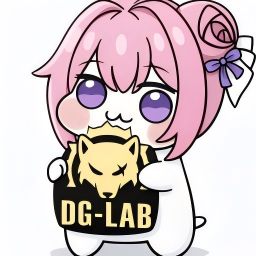

# astrbot_plugin_DG-LAB

  

  

> 大模型能实时解读你的对话，智能调整郊狼设备的强度和波形，让每一次互动都充满惊喜与节奏。**astrbot_plugin_DG-LAB** 将大模型与 DG-LAB 郊狼主机的控制完美融合，开启前所未有的沉浸式体验！

### ✨ 核心亮点
- **沉浸式对话体验**：与大模型聊天时，每句话都能触发独特的脉冲回应，让对话充满惊喜与节奏感。
- **智能强度惊喜**：大模型自主掌控每一次强度调节，带来未知惊喜，只能从对话中揣测节奏，确保渐进舒适。
- **智能波形创作**：大模型根据对话自主编排和生成独特波形，从呼吸般的温柔到心跳般的激情，全凭创意打造独一无二的脉冲体验。
- **专属人格空间**：自动启用专用人格，不影响正常使用。

## 功能概览

- 郊狼模式会话管理：支持 `/dglab start`、`/dglab stop`、状态查看、通道配置、部位配置和一键开火增量设置。
- 动态 LLM 工具：郊狼模式启用后，模型可调用波形、强度、停止输出、清空队列、自定义波形等工具。
- 波形扩展：支持内置波形，也支持上传 `.pulse` 文件扩展波形列表。
- 额度计费系统：支持免费额度、付费额度（发电额度）、模型倍率、群聊免计费、仅郊狼模式计费。
- 爱发电兑换：用户可通过订单号把爱发电金额兑换成付费 TOKEN。
- 管理员充值：管理员可直接为指定用户充值，并自动留下充值记录。

## 重要说明

在执行以下操作前：
- 重载插件
- 停用插件

请先确保所有客户端都已经执行 `/dglab stop` 退出郊狼模式。

否则可能出现：

WS 服务未能及时释放端口占用，插件重载后无法重新绑定端口

如果已经发生端口占用，需要手动处理占用进程后再重载插件。

## 环境要求

- [AstrBot](https://github.com/AstrBotDevs/AstrBot)
- DG-Lab APP（3.0）

## 安装

1. 打开astrbot插件市场
2. 点击右下方加号(安装插件)
3. 选择从链接安装，输入 https://github.com/guiyuanyuanbao/astrbot_plugin_DG-LAB ，点击安装

## 配置

插件主要配置位于 `_conf_schema.json`。

### 基础配置

- `ws_host`: WebSocket 监听地址，默认 `0.0.0.0`
- `ws_port`: WebSocket 监听端口，默认 `5555`
- `ws_external_host`: 生成二维码时使用的可访问地址
- `send_qr_raw_url`: 发送二维码时是否附带绑定链接
- `max_strength_a`: A 通道最大强度
- `max_strength_b`: B 通道最大强度
- `dglab_persona_id`: 郊狼共享人格 ID
- `dglab_persona_system_prompt`: 郊狼人格提示词
- `dglab_persona_begin_dialogs`: 郊狼人格预设对话
- `dglab_persona_error_reply`: 人格切换失败提示
- `dglab_default_persona_id`: 退出郊狼后默认恢复的人格
- `uploaded_wave_files`: 上传的 `.pulse` 波形文件列表

### 爱发电配置

- `afdian.base_url`: 爱发电开放平台 API 地址，默认 `https://afdian.com/api/open`
- `afdian.user_id`: 爱发电开放平台 `user_id`
- `afdian.token`: 爱发电开放平台 `token`

### 计费配置

- `billing.enabled`: 是否开启自动计费，默认 `false`
- `billing.free_quota_amount`: 免费额度
- `billing.free_refresh_hours`: 免费额度刷新周期，单位小时
- `billing.token_per_yuan`: 每 1 元可兑换多少 TOKEN
- `billing.charge_only_in_coyote_mode`: 是否仅在郊狼模式下计费
- `billing.skip_group_chat_billing`: 是否群聊不计费
- `billing.insufficient_balance_reply`: 余额不足时的提示文案
- `billing.provider_multipliers`: Provider 倍率规则列表，按当前会话的大模型提供商 `id` 精确匹配

插件会通过 `self.context.get_using_provider(umo=event.unified_msg_origin)` 获取当前会话的大模型提供商，并使用其配置 `id` 匹配倍率；未命中时默认 `1.0`。当前仅支持规则列表格式。

## 命令

### 普通用户命令

- `/dglab help`
  - 查看郊狼指令组帮助
- `/dglab start`
  - 开启郊狼模式
  - 返回二维码用于 APP 绑定
- `/dglab stop`
  - 关闭郊狼模式
  - 将 AB 通道强度归零
  - 取消工具注册
- `/dglab status`
  - 查看当前郊狼状态
- `/dglab channel A|B|AB`
  - 设置可用通道
- `/dglab part A:部位 B:部位`
  - 设置通道对应部位描述
- `/dglab fire [强度]` 或 `/dglab fire A:强度 B:强度`
  - 设置一键开火临时增量（范围 1-30）
  - 仅影响会话内 `dglab_quick_fire` 工具
- `/dglab wavelist`
  - 查看当前可用波形（内置 + 用户上传）
- `/dglab waveinfo <波形名>`
  - 查看指定波形详细信息（帧数、总时长、首末帧）
- `/dglab quota`
  - 查看自己的免费额度、付费额度（发电额度）、总额度和刷新时间
- `/dglab redeem <订单号>`
  - 兑换爱发电订单为付费 TOKEN

### 管理员命令

- `/dglab quota-list [user_id=xxx] [limit=50]`
  - 查看额度记录
- `/dglab redeem-list [user_id=xxx] [order_id=xxx] [limit=50]`
  - 查看充值记录
- `/dglab recharge user_id=123 amount=6.66`
  - 手动为指定用户充值
- `/dglab refresh-free user_id=123`
  - 立即刷新指定用户的免费额度
- `/dglab refresh-free all=true`
  - 立即刷新当前所有已有额度记录用户的免费额度

## 计费规则

- 计费用户以消息发送者 ID 为准，不按会话 ID 计费。
- 免费额度为惰性刷新：新用户首次命中时发放首份免费额度；到达刷新周期后，首次命中时重置为配置值。
- 管理员可通过 `/dglab refresh-free user_id=xxx` 或 `/dglab refresh-free all=true` 立即刷新免费额度，这会把免费额度重置为当前配置值并更新时间。
- 自动计费时，优先扣免费额度。
- 如果免费额度不足，本次只会把免费额度扣到 `0`，不会立即扣付费额度（发电额度）；下一次请求才会开始扣付费额度（发电额度）。
- 付费额度（发电额度）最低只扣到 `0`，不会出现负数。
- 群聊是否计费、是否只在郊狼模式计费，都由 `billing` 配置控制。

## 爱发电兑换与充值

- `/dglab redeem <订单号>` 只接受支付成功的订单。
- 金额优先使用 `show_amount`，缺失时回退到 `total_amount`。
- 兑换结果按 `floor(金额 * billing.token_per_yuan)` 计算。
- 同一订单只允许兑换一次。
- 管理员手动充值会写入充值记录，`source` 为 `manual_admin`。
- 管理员手动充值记录的 `order_id` 格式为 `manual:{admin_id}:{user_id}:{ts}`。

## 上传波形说明

- 支持在配置项 `uploaded_wave_files` 中上传多个 `.pulse` 文件。
- 文件会从 AstrBot 默认目录读取：`plugin_data/astrbot_plugin_DG_LAB/files/uploaded_wave_files/`。
- 波形在插件初始化阶段加载（配置变更触发插件重载后生效）。
- 加载成功后会与内置波形一起出现在 `/dglab wavelist` 和 `wave` 相关工具可用列表中。

## LLM 工具

仅在郊狼模式开启且设备绑定后可用：

- dglab_set_strength
- dglab_send_wave
- dglab_timed_switch_wave
- dglab_send_wave_combo
- dglab_send_custom_wave
- dglab_quick_fire
- dglab_get_status
- dglab_clear_wave
- dglab_stop_output

### 一键开火说明

- 命令 `/dglab fire` 用于设置会话内一键开火增量：
  - `/dglab fire 10`：A/B 通道都设置为 10
  - `/dglab fire A:8 B:12`：分通道设置

## 协议说明

本插件仅实现 DG-Lab 的 APP 收信协议，不使用前端协议。

- 强度上报格式：`strength-a+b+aLimit+bLimit`
- 强度控制格式：`strength-channel+mode+value`
- 波形下发格式：`pulse-A:[...]` / `pulse-B:[...]`
- 清队列格式：`clear-1` / `clear-2`

## 常见问题

1. 扫码后无法绑定
- 检查 `ws_external_host` 是否可从手机访问
- 检查防火墙是否放行 `ws_port`（默认 5555）

2. 状态里强度上限为 0
- 先在 APP 侧手动调整一次强度或上限，触发上报
- 确认绑定成功消息是否出现

## 内置波形

本插件在 `dg_waves.py` 中提供若干内置波形（直接可通过工具或大模型调用）：

- `breathe`（呼吸）：模拟缓慢吸呼的起伏。
- `tide`（潮汐）：长周期涨落，类似潮汐上升/下降。
- `combo`（连击）：短促的连击脉冲。
- `fast_pinch`（快速按捏）：快速重复按捏感。
- `pinch_crescendo`（按捏渐强）：按捏力度逐步增强的过渡。
- `heartbeat`（心跳节奏）：模拟心跳的节奏脉冲。
- `compress`（压缩）：由强到弱或由弱到强的压缩式变化。
- `rhythm_step`（节奏步伐）：节奏化的步伐/鼓点型波形。

## 开发说明

- WebSocket 中继与控制器实现：dg_server.py
- 工具实现：dg_tools.py
- 波形预设与上传波形加载：dg_waves.py
- 插件入口与指令：main.py

### WS 服务器机制

WS 服务采用“按需启动 + 空闲关闭”：
- 第一个会话执行 `/dglab start` 时启动 WS
- 后续会话复用同一个 WS 实例
- 最后一个会话执行 `/dglab stop` 后，WS 自动关闭

实现中包含启动锁，避免并发重复启动导致端口冲突。

### 郊狼人格生成与删除机制

郊狼人格采用“共享人格”模式：
- 有效配置 `dglab_persona_system_prompt` 时：
  - 首次启用郊狼模式会创建或更新共享人格
  - 后续会话复用该人格
- 所有会话退出郊狼模式后：
  - 删除共享郊狼人格，避免污染人格库

每个会话仍会记录进入郊狼前的人格，并在 `/dglab stop` 时恢复。

### 动态 Tools 机制（兼容性提示）

本插件使用动态注册与动态删除 Tools：
- 郊狼模式激活时注册 Tools
- 无活跃会话时卸载 Tools

其中，动态删除使用了对内部工具列表的直接移除方式（非开发文档提及的标准公开路径）。

这意味着：
- 当前版本可用
- 随 AstrBot 版本更新可能失效
- 若升级后出现工具残留/未卸载问题，请优先检查该机制兼容性

## 版本

当前版本：`v2.0.0`

> **安全提示（免责声明与使用承诺）**：安装、启用或使用本插件，即视为你已阅读并理解 DG-LAB 软件及设备提供的风险提示，并已知悉可能存在的风险与禁忌事项。
>
> 同时承诺：已对本插件相关风险作出与上述一致的知情确认，基于自愿原则使用，并对由此产生的风险、损害或其他后果自行承担责任。
>
> 并进一步确认：如因使用过程产生任何问题、纠纷或损失，由使用者自行承担责任，本项目及维护者不承担由此产生的责任。
>
> 如你不同意上述条款，请勿安装、启用或使用本插件；你一旦安装、启用或使用，即视为已同意并接受上述条款。
>
> 使用建议：请从低强度开始并循序渐进；如存在心脏起搏器、癫痫、妊娠等情况，请先咨询专业医生；若出现不适、疼痛、头晕、心悸或皮肤明显刺激，请立即停止（执行 `/dglab stop` 或调用 `dglab_stop_output`）并及时就医。
